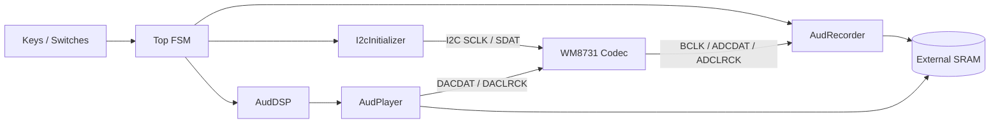

# Lab 3 — Audio Recorder / Player with I²C Codec Bring-Up and Variable-Speed DSP

**Course:** Digital Circuits Lab, National Taiwan University (Fall 2025)
**Board:** Terasic DE2-115 (Intel Cyclone IV E, EP4CE115F29C7)
**Codec:** Wolfson **WM8731** (I²S audio + I²C control)
**Language:** SystemVerilog
**Toolchain:** Quartus II 15.0 · Qsys (Altpll IP) · Synopsys VCS

---

## Overview

A self-contained **audio recorder / player** that exercises three concerns common to mixed-signal SoC sub-systems:

1. **Peripheral bring-up** — boot the WM8731 audio codec over **I²C** with the correct register sequence and clocking.
2. **Streaming data capture** — record up to **30 seconds** of 16-bit PCM from the codec's I²S serial output into the on-board **1 M × 16 SRAM**.
3. **Real-time DSP** — play back at **1×, 2×–8× faster, or 2×–8× slower**, using either **piecewise-constant** (sample-and-hold) or **linear-interpolation** reconstruction in slow modes.

All clocks (system, codec MCLK / BCLK, I²C SCLK, SRAM access) are managed through a Qsys-generated PLL and per-module clock dividers; there is no soft-CPU in the design — the entire control plane is hand-written RTL.

---

## System Architecture



---

## Module Breakdown

### `Top.sv` — Top-level FSM

Five states governing the global flow of the system:

| State | Triggered by | Action |
|-------|-------------|--------|
| `S_IDLE` | power-on / reset | Idle; I²C not yet completed |
| `S_I2C` | automatic after reset | Run `I2cInitializer` to write the WM8731 register list |
| `S_RECD` | `Key0` (start) | Stream ADC samples to sequential SRAM addresses |
| `S_PLAY` | `Key0` again | Read SRAM, pass through `AudDSP`, drive DAC |
| `S_PLAY_PAUSE` | `Key1` | Freeze SRAM read pointer; hold DAC output |

Speed and reconstruction mode are selected by the on-board switches (`i_speed[2:0]`, `i_is_slow`, `i_slow_mode`).

### `I2cInitializer.sv` — Codec boot sequence

A small FSM that walks through the **WM8731 register-write list** over I²C (`SCLK` / `SDAT`, 2-wire). The reference clock fed to this module must be ≤ 100 kHz; we generate it with the **Altpll** IP from the 50 MHz system clock. The codec power-down register is used to gate `XCLK` until the configuration sequence completes, avoiding glitches on the audio path.

### `AudRecorder.sv` — ADC capture

Samples `i_AUD_ADCDAT` synchronously to `BCLK` / `ADCLRCK` and writes successive 16-bit words to SRAM. A write-address counter advances with each completed sample, and a stop signal is asserted when the 30-second buffer is full.

### `AudDSP.sv` — Variable-speed DSP

| Mode | Address increment per output sample | Output value |
|------|-------------------------------------|--------------|
| 1× | `+1` | `mem[addr]` |
| 2×–8× **fast** | `+N` | `mem[addr]` (sample skipping) |
| 2×–8× **slow, piecewise** | `+1` every `N` outputs | `mem[addr]` (sample-and-hold) |
| 2×–8× **slow, linear interp.** | fractional addr `addr + k/N` | `mem[i] + (k/N)·(mem[i+1] − mem[i])` |

Linear-interpolation coefficients are computed in **fixed-point arithmetic** and updated on the playback clock. This avoids the harmonic distortion ("zipper" artefact) that pure sample-and-hold introduces at very low speeds.

### `AudPlayer.sv` — DAC output

Serialises the 16-bit word emitted by `AudDSP` onto `o_AUD_DACDAT`, synchronously with `BCLK` and `DACLRCK`, matching the I²S timing the codec expects.

### `Altpll/` — PLL IP

Qsys-generated PLL (`Altpll.qsys` → `Altpll/synthesis/Altpll.{qip,v}`) that derives the low-frequency reference for `I2cInitializer` from the 50 MHz on-board clock. The `.qip` is referenced from the Quartus project file.

---

## Skills Demonstrated

- **Mixed-signal codec bring-up**: writing an I²C controller from scratch and sequencing the correct WM8731 register list, including reset / power-up ordering.
- **Streaming-data system design**: full ADC → on-chip control → off-chip SRAM → DAC pipeline, with multiple asynchronous clock domains (system, BCLK, I²C SCLK, MCLK).
- **Fixed-point DSP for real-time audio**: implementing linear interpolation for 2×–8× slow playback, in synthesizable RTL with no soft-CPU or DSP block.
- **IP integration**: using **Qsys / Platform Designer** to instantiate the Altpll, then wiring it into a hand-written RTL top.

---

## Repository Layout

```
lab03_audio_i2c/
├── src/
│   ├── Top.sv                  # Top-level FSM
│   ├── I2cInitializer.sv       # I²C boot sequence for WM8731
│   ├── AudRecorder.sv          # ADC → SRAM capture
│   ├── AudDSP.sv               # Variable-speed / interpolation DSP
│   ├── AudPlayer.sv            # SRAM → DAC output
│   └── DE2_115/                # Pin assignments, SDC, DE2-115 wrapper
├── Altpll/synthesis/           # Generated PLL (.qip / .v)
├── Altpll.qsys                 # Qsys PLL project
├── Lab3_lecture.pdf            # Lab spec
├── Lab3_sup1_audiocodec.pdf    # WM8731 reference
├── Lab3_sup{2..4}_*.pdf        # SRAM / LCD / control-panel guides
└── team12_lab3_report.pdf      # Lab report
```

---

## Build & Verify

1. Open the Quartus project (`.qpf` / `.qsf`) in **Quartus II 15.0**.
2. Confirm `Altpll/synthesis/Altpll.qip` is included (already referenced in `.qsf`).
3. Compile and program the `.sof` to the DE2-115.
4. Sanity check on bring-up: status LEDs should reflect successful I²C completion before recording becomes available.

> Audio paths are not exhaustively co-simulated — real-time `BCLK` / `LRCK` interaction with a real codec is hard to model accurately. Hardware bring-up on the actual board, with on-board LEDs and seven-segment displays as debug taps, is the primary verification method.

---

## Controls (DE2-115)

| Input | Function |
|-------|----------|
| `Key0` | Start recording / start playback |
| `Key1` | Pause playback |
| `Key2` | Stop |
| `SW[2:0]` | Speed multiplier (1–8) |
| `SW[3]` | Slow-mode enable |
| `SW[4]` | Reconstruction mode (piecewise / linear) |
| `LEDR` / `LEDG` | State and timing indicators |
| Seven-segment | Speed setting, record / play time |
